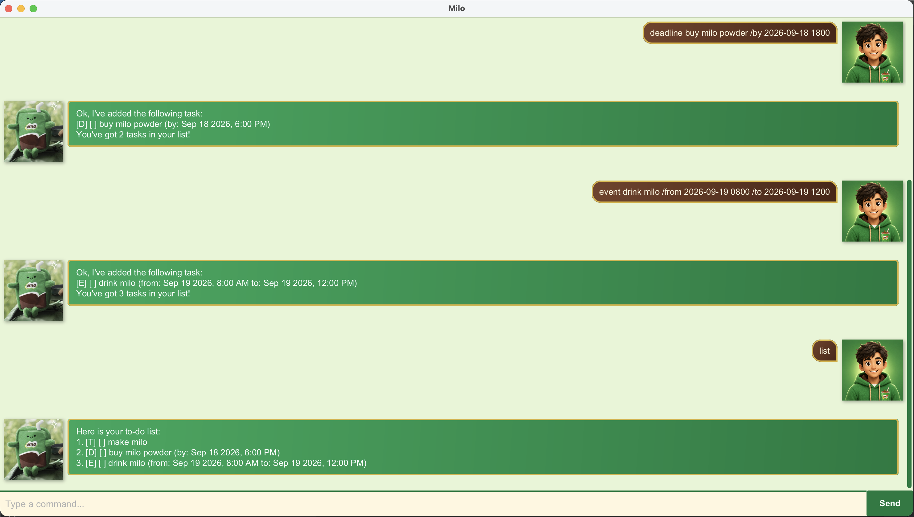

# Milo User Guide

Meet **Milo**, your playful, occasionally angsty buddy for tasks, deadlines, and events.



## Getting started

1. Install **Java 25**.
2. Download the latest JAR from [Releases](https://github.com/yxyx88/ip/releases).
3. Move it to your chosen folder and name it `milo.jar`.
4. Open a terminal in that folder and run:

   ```sh
   java -jar milo.jar
   ```

Type a command, then press **Enter** or click **Send**. Try `todo make milo`, then `list`.

- Use lowercase commands and flags, separated from arguments by spaces.
- Replace uppercase placeholders such as `DESCRIPTION` with your own values.
- Resize the window or scroll to read earlier replies.
- Red replies indicate errors. Edit the retained command and try again.
- Blank submissions are ignored.

## Adding tasks

### To-dos: `todo`

Add a task without a date.

**Format:** `todo DESCRIPTION`

**Example:** `todo make milo`

New tasks are incomplete.

### Deadlines: `deadline`

Add a task with a due date and optional time.

**Format:** `deadline DESCRIPTION /by DATE`

**Example:** `deadline buy milo powder /by 2026-09-18 1800`

Due: 18 September 2026, 6 PM.

### Events: `event`

Add an activity with start and end dates.

**Format:** `event DESCRIPTION /from START /to END`

**Example:** `event drink milo /from 2026-09-19 0800 /to 2026-09-19 1200`

Runs from 8 AM to noon on 19 September 2026. Both endpoints are required; check their order, as Milo does not.

### Date and time formats

Supported formats:

| Format | Example |
| --- | --- |
| `yyyy-MM-dd` | `2026-09-18` |
| `yyyy-MM-dd HHmm` | `2026-09-18 1800` |
| `d/M/yyyy` | `18/9/2026` |
| `d/M/yyyy HHmm` | `18/9/2026 1800` |

Use 24-hour times without colons: `1800` means 6 PM. Omitted times default to midnight, displayed as a date only. Words like `tomorrow` are unsupported.

## Viewing and finding tasks

### Show everything: `list`

Show all tasks and their numbers, including completed tasks.

```text
Here is your to-do list:
1. [T] [ ] make milo
2. [D] [ ] buy milo powder (by: Sep 18 2026, 6:00 PM)
3. [E] [ ] drink milo (from: Sep 19 2026, 8:00 AM to: Sep 19 2026, 12:00 PM)
```

`[T]` = to-do, `[D]` = deadline, `[E]` = event. `[ ]` = incomplete; `[X]` = completed.

### Search descriptions: `find`

**Format:** `find KEYWORD`

**Example:** `find milo`

Find descriptions containing your text, ignoring case. Multiple words form one search phrase.

**Use numbers from `list` when changing tasks.** Search results have separate numbering.

## Updating tasks

### Mark or unmark a task

| Action | Format | Example | Result |
| --- | --- | --- | --- |
| Mark completed | `mark NUMBER` | `mark 1` | Task 1 becomes `[X]`. |
| Mark incomplete | `unmark NUMBER` | `unmark 1` | Task 1 becomes `[ ]`. |

Numbers start at **1**, using the full `list`.

### Change dates: `reschedule`

Change dates on an incomplete deadline or event.

| Task type | Example | Result |
| --- | --- | --- |
| Deadline | `reschedule 2 /by 2026-09-20 1800` | Changes the due date/time. |
| Event: start only | `reschedule 3 /from 2026-09-19 0900` | Changes start; keeps end. |
| Event: end only | `reschedule 3 /to 2026-09-19 1300` | Changes end; keeps start. |
| Event: both endpoints | `reschedule 3 /from 2026-09-20 0800 /to 2026-09-20 1200` | Moves both endpoints. |

Use each flag once. Omitted event endpoints stay unchanged—check the resulting dates. To-dos cannot be rescheduled; completed tasks must be unmarked first.

### Delete tasks

**Format:** `delete NUMBER`

**Example:** `delete 1`

Removes the task. Numbers shift after deletion; run `list` before your next change.

`delete all` removes every task. **Immediate deletion; no confirmation or undo.**

## Saving and closing

Tasks save automatically to `data/milo.txt` and reload on startup. Launch from the same folder each time. Chat history is not saved.

For saving/loading errors, check data-folder permissions. Unsaved changes may be lost on restart.

`bye` gives a farewell but **does not close the GUI**. Use the window's close button.

## Command summary

| Command | Purpose |
| --- | --- |
| `todo DESCRIPTION` | Add a task without a date. |
| `deadline DESCRIPTION /by DATE` | Add a deadline. |
| `event DESCRIPTION /from START /to END` | Add an event. |
| `list` | Show all tasks and their numbers. |
| `find KEYWORD` | Search task descriptions. |
| `mark NUMBER` / `unmark NUMBER` | Change completion status. |
| `reschedule NUMBER /by DATE` | Move a deadline. |
| `reschedule NUMBER /from START /to END` | Move an event; either endpoint may be omitted. |
| `delete NUMBER` / `delete all` | Remove one task or all tasks. |
| `bye` | Say goodbye. |
